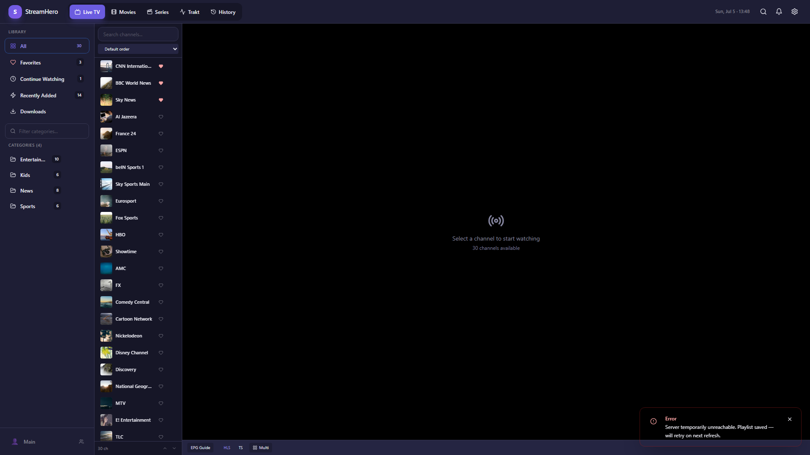
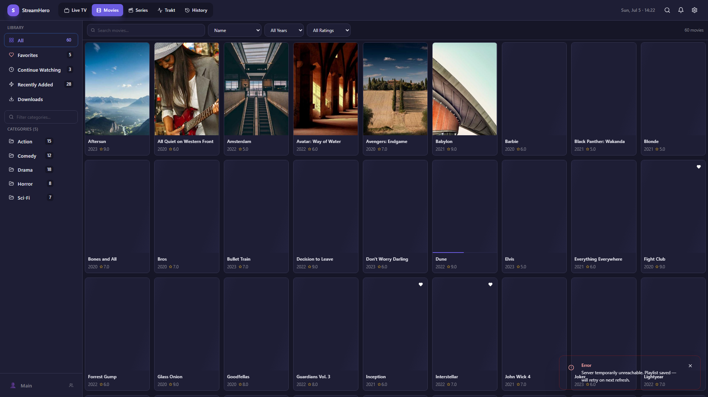
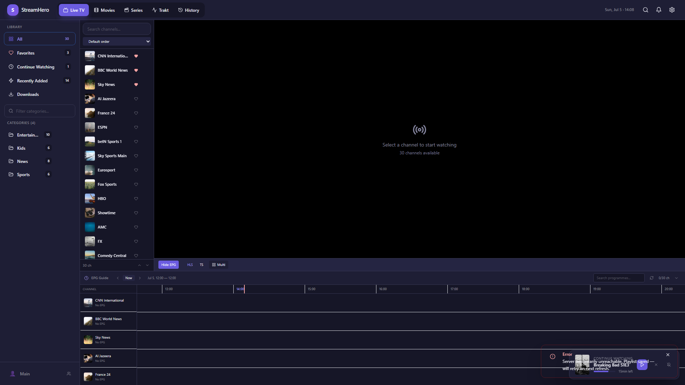
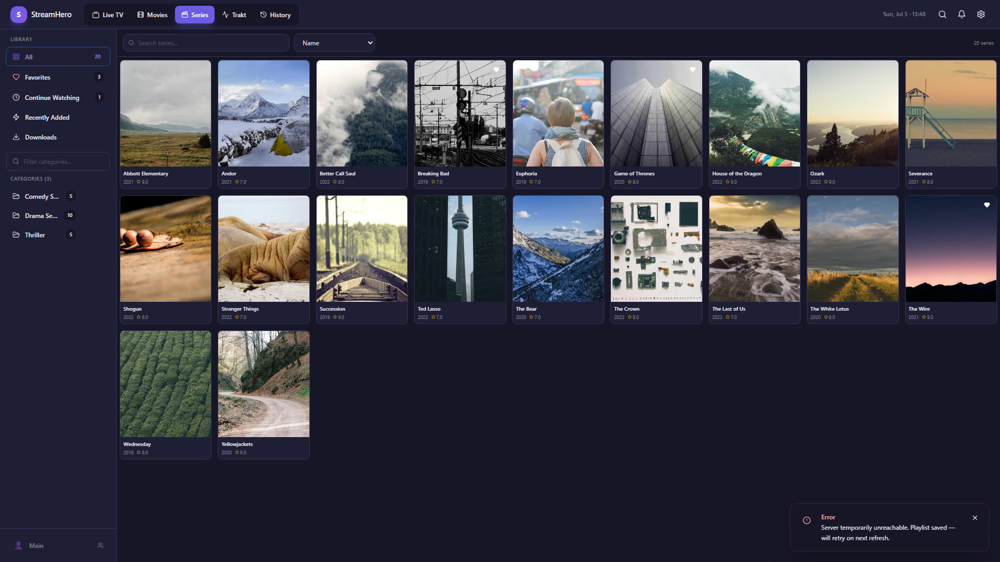

<h1 align="center">StreamingHero Player</h1>

  A modern, fast IPTV & media player for Windows. 
  Built with Electron, MPV, and HLS.js.

  
  
  

---

## Features

- 🎬 **Live TV, Movies & Series** — Full IPTV support (M3U/Xtream Codes)
- ⚡ **MPV-powered playback** — Hardware-accelerated, supports HEVC/H.265, 4K
- 🔄 **HLS.js fallback** — Browser-based player when MPV isn't needed
- 📺 **EPG Guide** — Electronic Program Guide with auto-refresh
- 🎨 **Modern UI** — Dark theme, customizable accent colors, responsive layout
- 📱 **Remote Control** — Control from your phone via local network
- 🔍 **OpenSubtitles** — Auto-download subtitles for movies
- ⬇️ **Downloads** — Save movies/series for offline viewing
- 🎯 **Multi-profile** — Switch between playlists and configurations
- ⌨️ **Keyboard shortcuts** — Full hotkey support
- 🔐 **Secure credentials** — Encrypted storage via OS keychain

## Download

👉 **[Download Latest Release](https://github.com/streamingheroplayer/streamingheroplayer/releases/latest)**

Available as:
- **Installer** (`.exe`) — Standard Windows installation
- **Portable** (`.exe`) — No installation needed, run from anywhere

## Screenshots

   
  <em>Live TV</em>

   
  <em>Movies with detail panel</em>

   
  <em>Electronic Program Guide</em>

   
  <em>Series library</em>

## Requirements

- Windows 10/11 (64-bit)
- Internet connection
- Your own IPTV playlist (M3U URL or Xtream Codes credentials)

## Getting Started

1. Download and install StreamingHero Player
2. Open the app and add your playlist (Settings → Playlists)
3. Wait for channels/content to load
4. Enjoy!

## FAQ

**Q: Does StreamingHero provide IPTV content?**
No. StreamingHero is a media player only. You need your own IPTV subscription/playlist.

**Q: Is MPV required?**
No. MPV is bundled for best codec support (HEVC, etc.), but the built-in HLS.js player works for most streams.

**Q: My antivirus flags the app?**
This is a false positive common with unsigned Electron apps. The app is open-source for inspection. You can add an exception in your antivirus.

## Feedback & Bug Reports

Found a bug or have a feature request?

→ [Open an Issue](https://github.com/streamingheroplayer/streamingheroplayer/issues/new/choose)

## Legal

StreamingHero Player is a media player application. It does **not** host, provide, or distribute any content or IPTV services. Users are responsible for the content they access through their own playlists.

---

  Made with ☕ by the StreamingHero team

